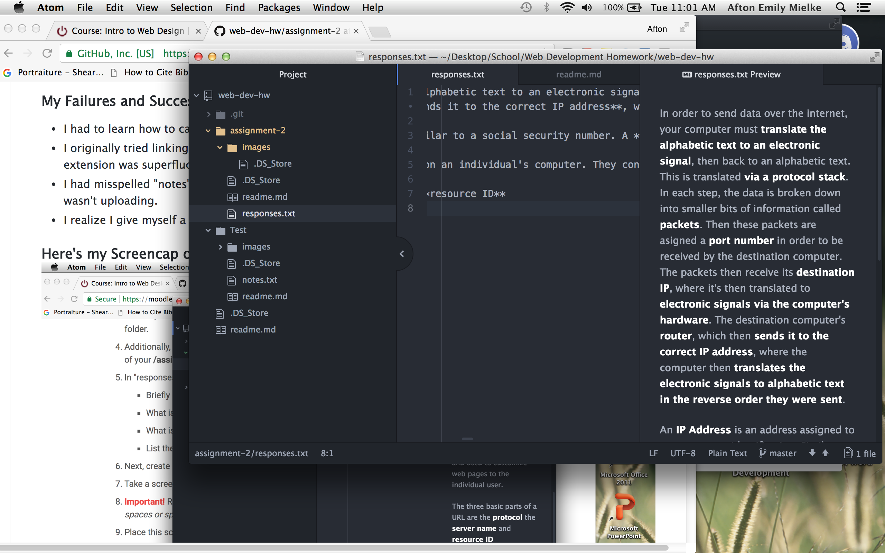

# Assignment 2

A *Version Control System* is a method of managing and tracking changes made between writing code and its publication to a website. It also allows you to work on your code from more than one place, and allows you to collaborate in your project and tracks changes made during collaboration.

Here are my [Response Answers from Part 1: Assignment](./responses.txt)

## Work Cycle
### What I Learned
- Writing in atom
- Saving changes
- Witnessing and reviewing changes in GitHub Desktop
- Naming those specific changes
- Pushing those specific changes through to GitHub online
- Linking to my own repository
  - Linking using relative URLS as the admin of a page
  - Within the same file
  - Within other files

### My Failures and Successes
- I had to learn how to capture a screencap on my macbook
- I originally tried linking my responses using /assignment-2/responses.txt, I realized the "/assignment-2/" extension was superfluous
- I had misspelled "notes" in my /notes.txt link, which took an embarrassing amount of time to catch why it wasn't uploading.
- I realize I give myself a quick "thumbs-up" whenever I succeed in something I'm struggling with.

### Here's my Screencap of Work from Part 1: Assignment
