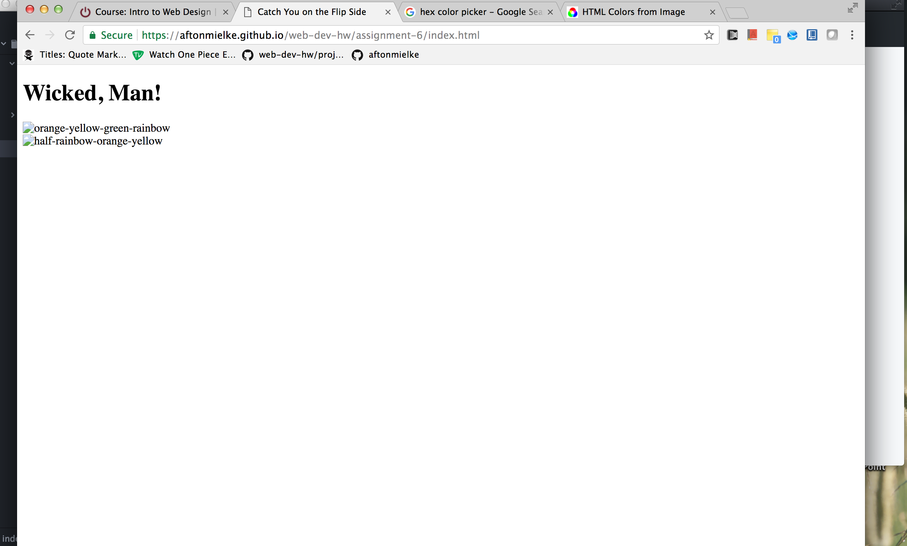

# Assignment 6: Color
## Technical Report

### Design Process
To start my design process of this project, I chose the seventies right off the bat to start designing my page art after. Then, after choosing, I chose my colors, and decided to go with a square motif, much like the one in the teaching module. I chose rainbows to juxtapose my squares, as both were pretty popular in the seventies.

### Color Palette
In order to choose my colors for this project I found a color picker, with which I opened my two images and found the hex code for each of my colors, and then decided to go either a little darker or lighter, as to compliment the color from the images. The colors I based my theme off of were hex values #F29400 for orange, #F29400 for yellow, #D4D700 for green.

### My Work Cycle
#### Failures
- I struggled a lot with the initial formatting of this page.
- The positioning of the boxes
- The positioning of the images
- Finding the right opacity for each box

#### Successes
- I was pretty proud of the fact that I found a color picker to choose my color theme
- I quickly found colors to match one another
- The declaration of the size and color of each box was pretty simple to declare

### Here's my Screencap of Work from Assignment 6: Color 
